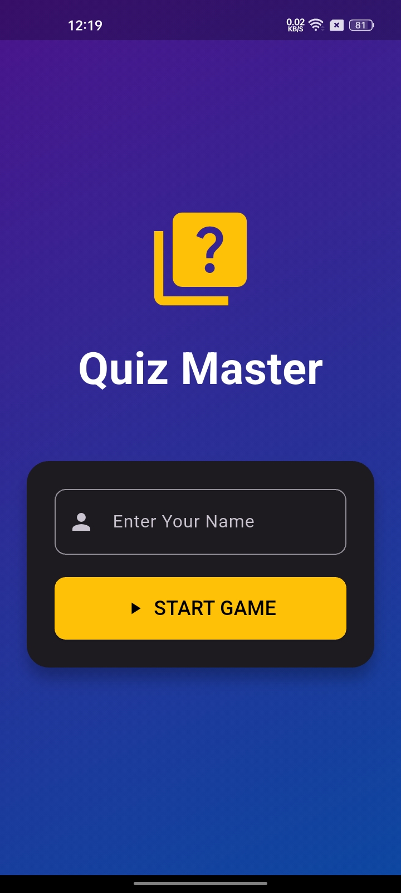
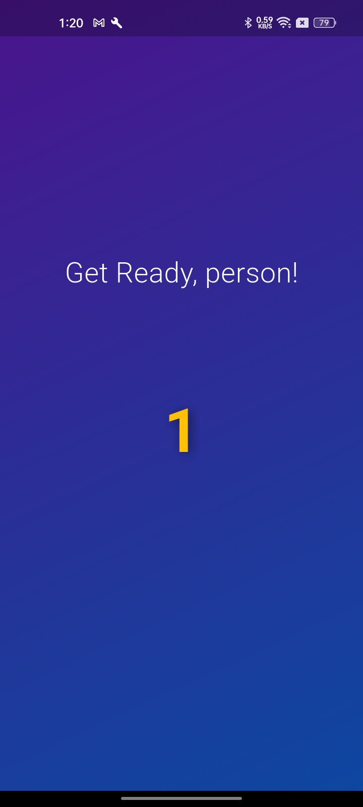
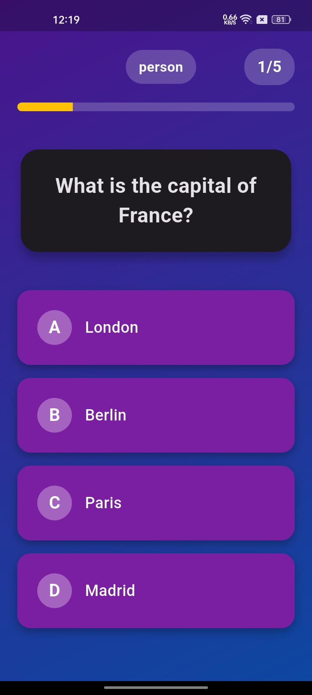
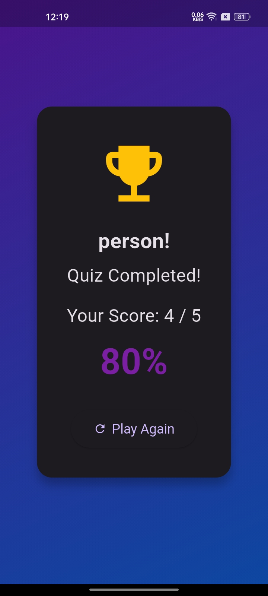

# 🎯 Quiz Master

### A Beautiful Animated Quiz Game Built with Flutter

 

Test your knowledge with smooth animations, real-time score tracking, and a stunning UI.

 

---

## 📥 Download App

 

 

👆 **Click the button above to download the latest APK**

 

| Platform | Download | Size |
|:---:|:---:|:---:|
| Android |  | ~15 MB |
| Android (arm64) |  | ~10 MB |
| All Releases |  | — |

---

## ✨ Features

- 🎮 **Player Name Entry** — Personalized experience with custom player name
- ⏳ **Animated Countdown** — 3-2-1 countdown timer before quiz starts
- 🎨 **Beautiful UI** — Gradient backgrounds, cards, and polished design
- 🔄 **Smooth Animations** — Slide, fade, scale, and bounce transitions
- ✅ **Instant Feedback** — Green for correct, red for wrong answers
- 📊 **Progress Tracking** — Animated progress bar and live score
- 🏆 **Results Screen** — Final score with percentage and replay option
- 📱 **Responsive Design** — Works on all screen sizes

---

## 📸 Screenshots

| Name Entry |                Countdown                |          Quiz Screen          |           Result Screen           |
|:---:|:---------------------------------------:|:-----------------------------:|:---------------------------------:|
|  |  |  |  |

---

## 🎮 How to Play

1. 📝 **Enter your name** on the welcome screen
2. ▶️ **Tap "START GAME"** to begin
3. ⏳ **Wait for the 3-2-1 countdown**
4. 🤔 **Select an answer** from four options
5. ✅ **See instant feedback** — correct (green) or wrong (red)
6. ➡️ **Tap "Next Question"** to continue
7. 🏆 **View your final score** at the end
8. 🔄 **Tap "Play Again"** to restart

---

## 🚀 Getting Started (For Developers)

### Prerequisites

- [Flutter SDK](https://docs.flutter.dev/get-started/install) (3.0+)
- [Android Studio](https://developer.android.com/studio) or [VS Code](https://code.visualstudio.com/)
- Android Emulator or physical device